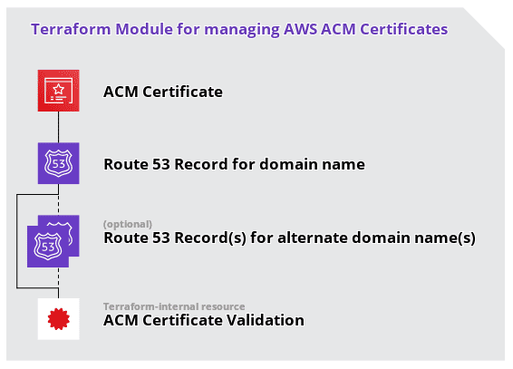

# Terraform Module: AWS ACM Certificate

> This repository is a [Terraform](https://terraform.io/) Module for managing AWS [ACM Certificates](https://docs.aws.amazon.com/acm/latest/userguide/acm-overview.html), using DNS-validation.

## Table of Contents

- [Terraform Module: AWS ACM Certificate](#terraform-module-aws-acm-certificate-dns-records)
  - [Table of Contents](#table-of-contents)
  - [Overview](#overview)
  - [Requirements](#requirements)
  - [Dependencies](#dependencies)
  - [Usage](#usage)
    - [Module Variables](#module-variables)
    - [Module Outputs](#module-outputs)
  - [Author Information](#author-information)
  - [License](#license)

## Overview



## Requirements

This module requires Terraform version `0.12.0` or newer.

## Dependencies

This module depends on a correctly configured [AWS Provider](https://www.terraform.io/docs/providers/aws/index.html) in your Terraform codebase.

## Usage

Add the module to your Terraform resources like so:

```hcl
module "acm-certificate" {
  source  = "operatehappy/acm-certificate/aws"
  version = "1.0.0"

  providers = {
    // NOTE: ACM Certificates for usage with CloudFront need to be created in the `us-east-1` region, see https://amzn.to/2TW2J16
    aws.certificate = aws.us-east-1
  }

  domain_name            = var.domain_name
  alternate_domain_names = var.alternate_domain_names

  use_default_tags                    = true
  tags                                = {
    website = "https://example.com/"
  }
  
  route53_zone_id                     = "Z3P5QSUBK4POTI"
}
```

Then, fetch the module from the [Terraform Registry](https://registry.terraform.io/modules/operatehappy/acm-certificate) using `terraform get`.

Additional usage examples are available in the `examples` directory via [GitHub](https://github.com/operatehappy/terraform-aws-acm-certificate/tree/master/examples).

### Module Variables

Available variables are listed below, along with their default values:

| variable                               | type          | description                                                                          | default         |
|----------------------------------------|---------------|--------------------------------------------------------------------------------------|-----------------|
| `domain_name`                          | `string`      | Domain name for Certificate                                                          |                 |
| `alternate_domain_names`               | `string`      | Alternate Domain Names for Certificate                                               |                 |
| `use_default_tags`                     | `bool`        | Toggle to enable creation of default tags, containing Terraform Workspace identifier | `true`          |
| `tags`                                 | `map`         | Mapping of Tags of Certificate                                                       | `{}`            |
| `enable_certificate_transparency_log`  | `bool`        | Toggle to enable Certificate Transparency Log                                        | `true`          |
| `route53_zone_id`                      | `string`      | ID of Route 53 Zone to use for Certificate Validation                                | `null`          |

Additionally, the following variables are generated as [locals](https://www.terraform.io/docs/configuration/locals.html):

| key             | value                                                               |
|-----------------|---------------------------------------------------------------------|
| `default_tags`  | default tags containing Terraform Workspace identifier              |
| `merged_tags`   | merged value of `var.tags` and `local.default_tags` _or_ `var.tags` |

### Module Outputs

Available outputs are listed below, along with their description

| output        | description                                     |
|---------------|-------------------------------------------------|
| `id`          | ID of the Certificate                           |
| `arn`         | ARN of the Certificate                          |
| `domain_name` | Domain name for which the certificate is issued |                            |

## Author Information

This module is maintained by the contributors listed on [GitHub](https://github.com/operatehappy/terraform-aws-acm-certificate/graphs/contributors)

Development of this module was sponsored by [Operate Happy](https://github.com/operatehappy).

## License

Licensed under the Apache License, Version 2.0 (the "License").

You may obtain a copy of the License at [apache.org/licenses/LICENSE-2.0](http://www.apache.org/licenses/LICENSE-2.0)

Unless required by applicable law or agreed to in writing, software distributed under the License is distributed on an _"AS IS"_ basis, without WARRANTIES or conditions of any kind, either express or implied.

See the License for the specific language governing permissions and limitations under the License.
